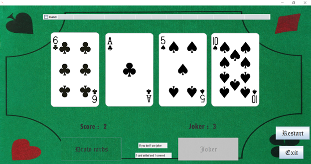

# Reussite

Bienvenue dans ** Reussite**, une version numérique et virtuelle du célèbre jeu de société. Ce projet est développé en Java 17. Toutes les librairies nécessaires sont incluses dans le projet, vous permettant de démarrer rapidement sans configuration supplémentaire.

## 📋 Fonctionnalités

- Interface utilisateur intuitive.
- Recréation fidèle des mécanismes du jeu de société.

---

## Aperçu de l'interface

Voici un aperçu de l'interface utilisateur de l'application :



---


## 🛠️ Configuration requise

- **Java** : JDK 17.
- **Système d'exploitation** : Windows, macOS, ou Linux.

*Toutes les dépendances nécessaires sont incluses dans le projet et n'exigent pas de téléchargement ou de configuration supplémentaire.*

---

## 🚀 Installation et Exécution

1. Clonez ou téléchargez ce dépôt :
   ```bash
   git clone https://github.com/TalhaK28/Reussite.git
   cd Reussite
